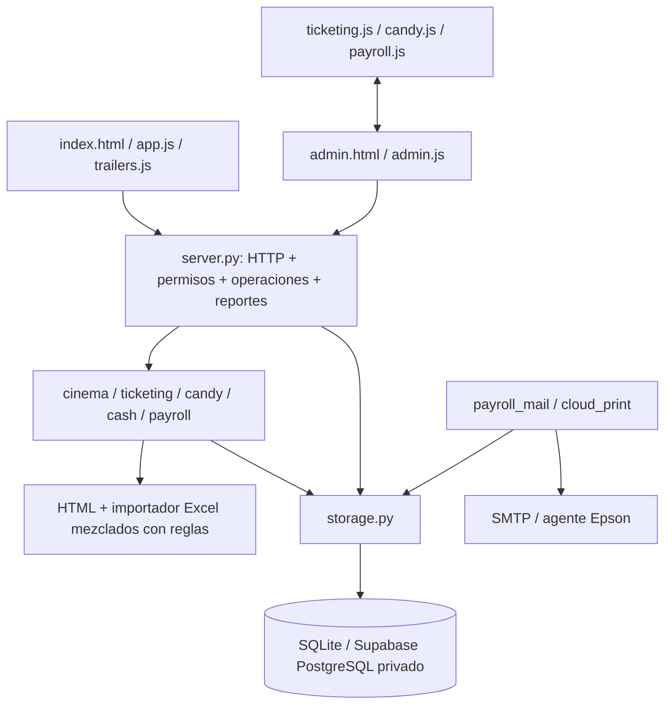

# Mapa previo a la migración

Auditoría: 8 de octubre de 2026, antes de modificar el código de aplicación.

## Stack y superficies

- Backend Python 3.14: HTTP de biblioteca estándar en local, WSGI/Gunicorn en producción. No framework MVC.
- Frontend HTML/CSS/JavaScript sin React. TypeScript 7 estricto solo cubre las primitivas de `src/shared/ui.ts`.
- `/index.html`: cartelera, película/horarios, sucursal y YouTube. `/admin.html`: login, selección de sucursal y panel por rol; navegación interna sin router de framework.
- Formularios HTML nativos; no hooks, Server Actions, React Hook Form o TanStack Query.
- SQLite local / PostgreSQL privado de Supabase en producción: agregado JSON/JSONB transaccional. Sesiones y limitación de login en tablas separadas.
- Autenticación propia por cookie HttpOnly/SameSite, versión de contraseña y caducidad. Gerencia/Contabilidad acceden a sucursales; demás roles a la asignada.
- No pasarela de pagos, reservas ni mapa de butacas. Los boletos consumen aforo; miércoles 2×1 consume dos plazas sin reducir precio.
- ESLint, TypeScript, Vitest, unittest Python y Playwright/axe. Build pequeño, sin framework cliente.

## Capacidades reales

Identidad y alcance; catálogo (películas, salas, funciones, banners/tráileres); boletería; Candy bar; caja; inventarios de Candy/bóveda y arqueos; salarios y biométrico; impresión; correo salarial; panorama e historial. Los reportes son presentaciones de estas capacidades, no un dominio de pagos.

## Estado y dependencias

Servidor autoritativo para precios, capacidad, existencias, permisos y cálculo salarial. El navegador conserva estado visual, carrito, selección de sucursal y respuestas de polling; sessionStorage conserva identificadores de venta pendiente para idempotencia. No hay acceso SQL ni claves de Supabase en UI.

`server.py` mezcla transporte, reglas, proyecciones y coordinación; `admin.js` mezcla bootstrap, sesión, peticiones, navegación y todas las vistas. Los otros scripts consumen sus variables léxicas implícitamente. Validadores genéricos viven en catálogo y obligan a caja/salarios a depender de él. Los recibos importan persistencia para decidir la etiqueta DEMO; la expansión de boletos vive en el controlador de impresora. El parser Excel está junto al cálculo salarial. El acceso SQL se reparte entre HTTP y trabajadores. No se detectaron ciclos Python; sí dependencia implícita recíproca entre la composición del panel y scripts de funciones.

## Configuración y seguridad preservadas

Configuración de despliegue en `.env.example`, `render.yaml`, `auth_config.py`; conexión PostgreSQL exclusivamente servidor. Esquema `erp_private`, RLS y permisos revocan acceso a roles públicos. Archivos operativos, credenciales y biométricos fuera del paquete de entrega. Se preservan rutas, formatos API, autenticación, esquema y datos durante la migración.

## Objetivo incremental

Extraer reglas y reportes por capacidad; contratos de aplicación para almacenamiento e importación; adaptadores concretos externos; composición explícita. Migrar luego las conexiones del frontend y reforzar límites con AST de Python y TypeScript ya disponibles. Validar cada extracción antes de continuar. No introducir React ni sustituir la base de datos.
