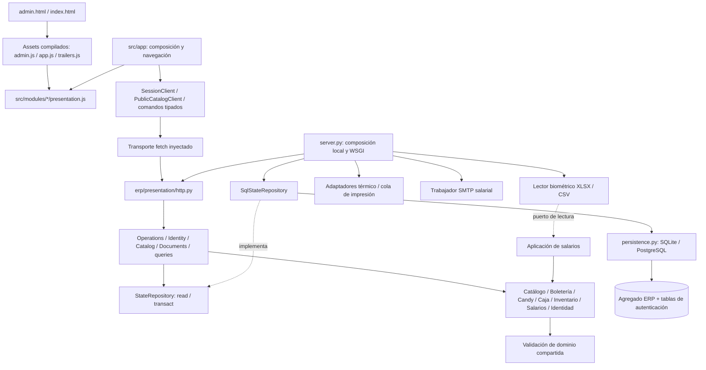

# Arquitectura de Universal

Actualizada el 8 de octubre de 2026. El mapa previo está en [architecture-current.md](architecture-current.md). Esta descripción corresponde a los módulos ejecutados, no a una propuesta de migración futura.

## Elección y alcance

Monolito modular con separación de dominio, aplicación, presentación y adaptadores. Python conserva las reglas autoritativas y la transacción; HTML/CSS/JavaScript conserva las pantallas, y TypeScript estricto define los nuevos contratos de cliente, sesión, consultas públicas, confirmación de ventas, preparación de formularios y primitivas UI. No se añadió React ni un segundo backend.

Las vistas heredadas se modularizaron en JavaScript. **No se afirma que todo el frontend esté convertido a TypeScript**: `tsc` cubre todos los `.ts`; ESLint y los flujos reales cubren las vistas `.js`. Esta distinción evita esconder una migración parcial con tipos `any` o desactivar comprobaciones.



## Capas y dependencias

| Capa | Ubicación | Responsabilidad |
|---|---|---|
| Dominio | `erp/modules/*/domain.py`, `admissions.py`, `trailers.py`, reglas puras de `operations.py` | Validar y transformar registros de negocio sin HTTP, SQL, SMTP, Windows ni renderizado. |
| Aplicación | `erp/application/{commands,queries,service,ports,documents}.py`, `modules/{identity,catalog,payroll}/application.py` | Autorizar comandos, coordinar capacidades, filtrar datos y delimitar transacciones. |
| Adaptadores | `erp/infrastructure/`, `identity/infrastructure.py`, `payroll/{biometric,mail}.py`, `ticketing/{thermal,print_queue,printing}.py` | Persistencia, entorno/cuentas, archivos externos, correo e impresora. |
| Presentación | `erp/presentation/http.py`, `erp/modules/*/presentation.py`, `src/modules/` | HTTP, documentos escapados y vistas/interacciones de navegador. |
| Composición | `server.py`, `wsgi.py`, `src/app/` | Construir adaptadores y conectar puertos; iniciar servicios y navegación. |
| Compartido | `erp/shared/domain/`, `src/shared/` | Validación transversal, contratos de transporte/sesión y primitivas visuales usadas por varias áreas. |

El dominio no importa adaptadores. Aplicación no importa implementaciones de persistencia, correo, lector Excel ni vistas. Shared no importa capacidades. La UI no accede a SQL, Supabase ni secretos.

No se creó una carpeta vacía por cada capa: una capacidad sencilla expone funciones en archivos claros. `domain.py` es su API de reglas públicas; `admissions.py` es la API pura para expandir entradas. La coordinación entre capacidades vive en `commands.py`. Candy consulta Caja; Boletería consulta Caja y Catálogo. Ninguna devuelve esa dependencia en sentido inverso.

## Capacidades y API

| Capacidad | API y reglas principales |
|---|---|
| Catálogo | `room_save`, `movie_save`, `schedule`, `cancel_show`, `remove`, `public_catalog`, `trailers.save`. Película es contenido; sala es aforo; función es sala/película/fecha/hora. Bloquea solapamientos y conserva ventas históricas. |
| Boletería | `checkout`, `tickets`. Cesta de varias funciones, precio verificado en servidor, aforo y requestId idempotente. 2×1 reduce unidades vendibles, no precio. Entradas individuales sin asiento numerado. |
| Candy | `checkout`, `request_void`, `review`, `ensure`. Códigos, existencias, ventas, solicitud contable y reversión controlada. |
| Caja | `opening`, `can_sell`, `summary`, `movement`, `void_movement`, `operations.execute`. Fondo opcional, ingresos/egresos, cierre y conciliación. |
| Inventario | `active`, `operations.execute`. Candy y bóveda, validación contable de movimientos, bloqueo durante arqueo y sustitución por conteo físico. |
| Salarios | `calculate`, `mutate`, `application.import_file(reader=...)`. Sueldo proporcional, descanso fijo, atrasos, extras, aprobación y cola individual de correo. El lector no calcula salarios. |
| Identidad | `Identity.login/resolve/logout`, puerto `SessionStore`, `scoped` y adaptador de configuración/cuentas. Cookies, hashes, expiración y rate limit mantienen el contrato previo. |
| Panorama / historial | Proyecciones de lectura y vistas de operación; no un dominio artificial de pagos. |

No existen reservas, pasarela de pagos o mapa de butacas. Un reporte salarial no acredita una transferencia.

## Estructura ejecutada

```text
server.py, wsgi.py              # composición y entradas existentes
migrate_data.py, print_agent.py # comandos operativos existentes
erp/
  application/                 # comandos, consultas, servicio y puertos
  infrastructure/              # persistencia y StateRepository SQL
  presentation/http.py         # rutas HTTP
  modules/
    catalog/                   # dominio, consultas públicas, metadatos de tráileres
    ticketing/                 # checkout, admissions, recibos, impresión
    candy/                     # checkout, anulaciones, recibos
    cash/                      # reglas, cierres, reporte
    inventory/                 # movimientos, arqueos, PDF
    payroll/                   # reglas, importación, decodificador, SMTP, reporte
    identity/                  # sesiones, alcance y configuración de cuentas
  shared/domain/               # validaciones transversales
src/
  app/                         # composición del panel, web y reproductor
  modules/
    identity/application.ts    # sesión/polling contra puerto HTTP
    catalog/                   # gestión, cartelera pública y reproductor
    ticketing/, candy/         # controladores UI + confirmación y recuperación de ventas
    payroll/, cash/, inventory/, operations/ # vistas y adaptadores de formularios por capacidad
  shared/                      # UI, contratos y puerto de transporte
tests/, test_*.py               # UI, contratos, dominio, HTTP e infraestructura
scripts/                       # build, límites arquitectónicos, paquete seguro
docs/adr/                      # decisiones y consecuencias
```

Los `.py` de compatibilidad en la raíz reexportan funciones para scripts existentes. No contienen una segunda implementación de reglas. Los scripts cliente de raíz son **salidas generadas**: editar `src/` y ejecutar build. HTML, CSS y URLs públicas conservan su ubicación y diseño.

## Datos y transacciones

`StateRepository` tiene lectura y `transact(operation)`. `Operations.execute` recibe ese puerto; `SqlStateRepository` lo implementa usando la conexión configurada. Un comando modifica una instantánea dentro de la transacción. Un error revierte todas las modificaciones.

Se mantiene el agregado JSON/JSONB, porque separar ventas, inventario y cierres en repositorios ficticios sobre el mismo documento ocultaría su atomicidad. SQLite usa `BEGIN IMMEDIATE`; el adaptador PostgreSQL mantiene el bloqueo de fila equivalente. No se cambió el esquema de Supabase, RLS ni permisos. Los trabajadores duraderos mantienen sus propias transacciones de reclamación/confirmación en adaptadores, separadas de la venta.

La conexión Supabase y las cuentas se resuelven exclusivamente en servidor. `erp_private` continúa fuera del acceso público; no se añadió cliente Supabase de navegador ni service-role expuesta. No hay infraestructura provisionada por esta tarea.

## Sesiones, consultas y documentos

`Identity` coordina login, rate limit, resolución y revocación mediante `SessionStore`; HTTP solo interpreta cookies y traduce errores a estados HTTP. Reloj, generación de tokens y verificación de contraseñas se inyectan desde `server.py`.

`Catalog` construye consultas públicas por sucursal mediante StateRepository. `Documents` selecciona y autoriza recibos, cierres, arqueos y planillas antes de invocar renderizadores inyectados. No importa HTML, PDF ni impresoras concretas. Se conservan las URLs y los permisos anteriores.

## Estado de cliente y validación

- Estado de aplicación: sesión, rol, sucursal y navegación, en la composición.
- Estado de servidor: snapshot filtrado y ETag. `SessionClient` descarta respuestas antiguas tras logout/login o un polling posterior; un 401 vigente expira la sesión.
- Estado UI: filtros, pestañas, diálogos, selección de horario y carrito dentro de cada controlador/vista.
- Persistido: identificadores y cestas de reintento en sessionStorage, decodificados con Zod. Se preserva el requestId para evitar ventas duplicadas.

Cada fábrica recibe un objeto limitado a sus dependencias declaradas mediante `viewPort`; las vistas no importan `src/app` ni otras vistas. La colaboración entre áreas se conecta con callbacks en la composición. Ya no se registran controladores de negocio en `window.ticketPOS`, `window.candyPOS` o `window.payrollUI`.

Zod valida el sobre de sesión, las cestas externas, confirmaciones de venta y consultas públicas de cartelera/tráileres. `prepare-command.ts` compone adaptadores de formulario de Caja, Inventario, Catálogo y Salarios; cada capacidad prepara sus propios campos. Los servicios cliente reciben `HttpTransport`; no llaman directamente a fetch. Los registros extensibles del snapshot mantienen campos específicos desconocidos sin coerción; no son tipos de base de datos. La validación monetaria, de permisos, aforo, stock y nómina permanece siempre en Python. Formularios nativos validan la interacción; no hay razón para introducir React Hook Form o TanStack Query.

## Ejemplos de flujo

**Venta de boletos:** vista → submitTicketSale/HttpTransport → HTTP → Operations → autorización → checkout → StateRepository confirma → impresión independiente. Si falla la impresora después del commit, la venta se conserva y se informa estado incierto; no se repite el cobro.

**Arqueo:** formulario contable → comando autorizado → snapshot del inventario bloqueado → PDF de presentación → conteo verificado → reemplazo atómico. Candy no ve existencias fuera de un arqueo vigente.

**Biométrico:** formulario → aplicación de importación → lector inyectado XLSX/CSV → tabla normalizada con epoch → reglas salariales → borrador → aprobación contable → cola SMTP. La entrega incierta conserva revisión manual y no reenvía automáticamente.

## Comprobaciones y límites

`npm run lint` ejecuta ESLint (incluye referencias indefinidas), inspección de imports frontend y AST Python. Impide dependencias hacia adaptadores desde dominio/aplicación, shared→features, feature→app, cruces UI entre capacidades y ciclos. No se añadió una herramienta de boundaries externa: se usan ESLint y biblioteca estándar. El analizador de imports TS admite imports estáticos comprobados por `tsc`; rechaza imports dinámicos hasta definir su regla.

`npm run typecheck`, `npm test`, `python -m unittest discover -q`, `npm run build`, `npm run test:e2e` completan la verificación. Pruebas con memoria demuestran que la aplicación no necesita SQL; pruebas SQL verifican rollback; integración verifica roles, concurrencia, sesiones, reportes y colas; Playwright verifica desktop/tablet/mobile con axe y errores de consola.

Deuda explícita: vistas JS aún sin tipado estático exhaustivo; agregado de estado completo serializa escrituras; reglas heredadas usan diccionarios Python, no entidades tipadas por campo; el protocolo de autenticación se conserva, pero sus casos de uso viven en Identity y reciben SessionStore. No se afirma capacidad de carga de producción ni impresión/SMTP/Supabase reales a partir de dobles de prueba. Consulte el informe de validación para resultados y alcance exactos.
